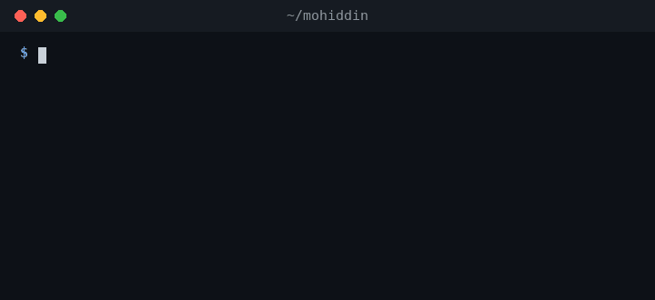
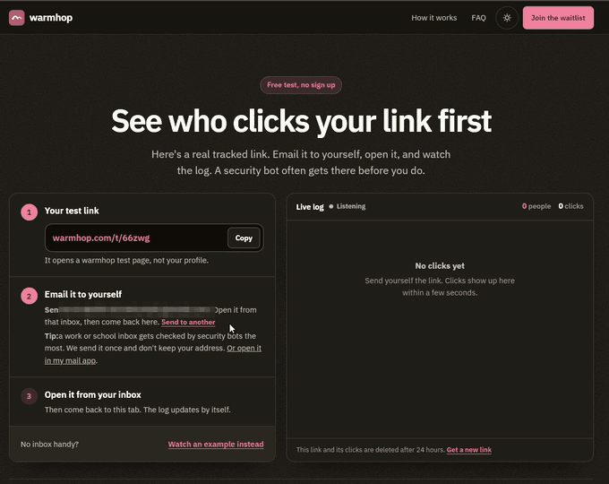
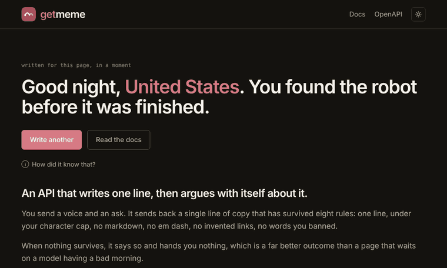
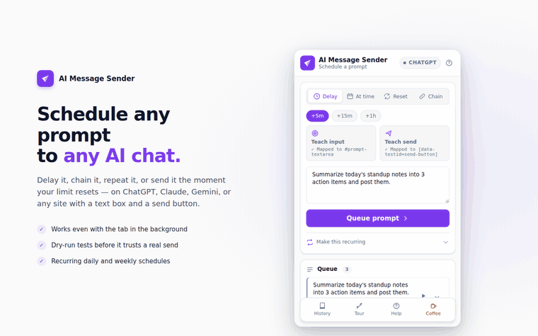
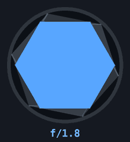

<div align="center">

<h1>Hi, I'm Mohiddin</h1>

<b>AI Engineer · RAG · AI agents · LLM evals</b>


<!-- GREETING:START daypart=afternoon date=2026-10-08 -->
<picture>
  <source media="(prefers-color-scheme: dark)" srcset="https://raw.githubusercontent.com/mohiddin7/mohiddin7/main/assets/greeting-dark.svg?v=2026-10-08-afternoon" />
  <source media="(prefers-color-scheme: light)" srcset="https://raw.githubusercontent.com/mohiddin7/mohiddin7/main/assets/greeting-light.svg?v=2026-10-08-afternoon" />
  
</picture>
<a href="#how-this-page-works" title="Written by getmeme for my time of day and your GitHub theme">ⓘ</a>
<!-- GREETING:END -->

<br/><br/>

<a href="#certs"></a>
<a href="https://papers.ssrn.com/sol3/papers.cfm?abstract_id=6163986"></a>
<a href="https://github.com/mohiddin7/adpilot/blob/main/evals/reports/latest.md"></a>

<picture>
  <source media="(prefers-color-scheme: dark)" srcset="https://raw.githubusercontent.com/mohiddin7/mohiddin7/main/assets/calendar-dark.svg?v=4d1b925bd6" />
  <source media="(prefers-color-scheme: light)" srcset="https://raw.githubusercontent.com/mohiddin7/mohiddin7/main/assets/calendar-light.svg?v=4d1b925bd6" />
  
</picture>


</div>

I'm an AI engineer. I build production RAG pipelines, AI agents, and the LLM evals that keep them honest. AWS certified in machine learning, data engineering and solutions architecture, and co-author of a 2026 paper benchmarking LLMs against encoder transformers.

### 🔨 What I'm building right now

<!-- CURRENTLY:START -->
<a href="https://github.com/mohiddin7/adpilot"><picture><source media="(prefers-color-scheme: dark)" srcset="https://raw.githubusercontent.com/mohiddin7/mohiddin7/main/assets/now-1-dark.svg?v=c16401d009" /><source media="(prefers-color-scheme: light)" srcset="https://raw.githubusercontent.com/mohiddin7/mohiddin7/main/assets/now-1-light.svg?v=3805a76260" /></picture></a>
<a href="https://warmhop.com/try"><picture><source media="(prefers-color-scheme: dark)" srcset="https://raw.githubusercontent.com/mohiddin7/mohiddin7/main/assets/now-2-dark.svg?v=a2be63ee9f" /><source media="(prefers-color-scheme: light)" srcset="https://raw.githubusercontent.com/mohiddin7/mohiddin7/main/assets/now-2-light.svg?v=a4c7e68558" /></picture></a>
<a href="https://getmeme.warmhop.com"><picture><source media="(prefers-color-scheme: dark)" srcset="https://raw.githubusercontent.com/mohiddin7/mohiddin7/main/assets/now-3-dark.svg?v=b8e07f1d5d" /><source media="(prefers-color-scheme: light)" srcset="https://raw.githubusercontent.com/mohiddin7/mohiddin7/main/assets/now-3-light.svg?v=e5f8402b12" /></picture></a>
<a href="https://github.com/mohiddin7/SATP_hosting"><picture><source media="(prefers-color-scheme: dark)" srcset="https://raw.githubusercontent.com/mohiddin7/mohiddin7/main/assets/now-4-dark.svg?v=5a38e81c59" /><source media="(prefers-color-scheme: light)" srcset="https://raw.githubusercontent.com/mohiddin7/mohiddin7/main/assets/now-4-light.svg?v=9a4648b366" /></picture></a>
<picture><source media="(prefers-color-scheme: dark)" srcset="https://raw.githubusercontent.com/mohiddin7/mohiddin7/main/assets/now-5-dark.svg?v=f33f968849" /><source media="(prefers-color-scheme: light)" srcset="https://raw.githubusercontent.com/mohiddin7/mohiddin7/main/assets/now-5-light.svg?v=bdf3eb0401" /></picture>

<sub>Updated Oct 8, 2026 from my commits on every branch of my personal and org repos, private ones included. Bars are commits over the window. I don't touch this; a workflow does.</sub>
<!-- CURRENTLY:END -->

### `$ whoami`

```python
class Mohiddin:
    role = "AI Engineer"
    focus = "ML and AI: RAG, agents, evals"
    certified = ["AWS ML", "AWS Data", "AWS Solutions Architect"]
    off_duty = "photography"

    def ship(self, change):
        if self.evals(change).passed:
            return deploy(change)
        # evals failed, so nothing ships
```

I build the thing I needed and couldn't find, then check who else needs it too.



### `$ ls projects/`

<table>
<tr>
<td width="50%" valign="top">
<br/>
<b><a href="https://github.com/mohiddin7/adpilot">adpilot</a></b> · <a href="https://adpilot.streamlit.app/">live demo</a><br/>
Ask your ad data a question in plain English, get SQL and a chart back. Evals score it 89.8/100 and it passes all 41 red-team cases.
</td>
<td width="50%" valign="top">
<br/>
<b><a href="https://warmhop.com/try">warmhop Link Tracker</a></b> · live<br/>
Put the link on your resume and find out when someone actually clicks it. No more guessing.
</td>
</tr>
<tr>
<td width="50%" valign="top">
<br/>
<b><a href="https://getmeme.warmhop.com">getmeme</a></b> · live<br/>
Prompt in, one short and safe line out. It wrote the greeting at the top of this page. GIFs and images are next.
</td>
<td width="50%" valign="top">
<br/>
<b><a href="https://github.com/mohiddin7/ai-message-sender">ai-message-sender</a></b><br/>
Schedules prompts to AI chat apps. I wanted it for one site, so I built a DOM picker and now it works on any page with a text box and a send button.
</td>
</tr>
</table>

Also: [the paper](https://papers.ssrn.com/sol3/papers.cfm?abstract_id=6163986) · [code-satp](https://github.com/eteitelbaum/code-satp) (fine-tuned transformers for event coding) · [SATP_hosting](https://github.com/mohiddin7/SATP_hosting) (Streamlit scraper and map of the incidents) · [news summarization](https://github.com/meetdaxini/NLP-News-Summarization)

### `$ cat stack.json`

<table>
<tr><td><code>"lang"</code></td><td>    </td></tr>
<tr><td><code>"genai"</code></td><td>            </td></tr>
<tr><td><code>"ml"</code></td><td>      </td></tr>
<tr><td><code>"aws"</code></td><td>        </td></tr>
<tr><td><code>"data"</code></td><td>       </td></tr>
<tr><td><code>"ship"</code></td><td>       </td></tr>
</table>

<a name="certs"></a>

### `$ ls certs/`

<a href="https://www.credly.com/badges/ea88a163-447c-49b2-9962-5b959e9258f5"></a>
<a href="https://www.credly.com/badges/4d78e824-4a6f-4dbe-aa84-bbd9d43fe99c"></a>
<a href="https://www.credly.com/badges/34216190-94e5-4580-a564-934ccaf38586"></a>

### `$ cat fun_fact.txt`



When I'm not building, I'm behind a camera. Honestly it's the same job: find the signal, ignore the noise, fix it in post.

My photos live on Instagram at [@mylenspeak](https://instagram.com/mylenspeak).

### `$ cat FAQ.md`

<details>
<summary><b>Frequently unasked questions</b></summary>
<br/>

**Is this README written by AI?**<br/>
The greeting up top is, by my own API. The jokes are mine, so complaints come to me.

**Can your agents delete prod?**<br/>
They can ask. A guardrail says no every time, and it is not polite about it.

**RAG or fine-tuning?**<br/>
Whichever one wins the eval. I stopped arguing with the scoreboard.

**What happens when the evals fail?**<br/>
Nothing ships, and I go find out why. Usually it was me.

**Why photography?**<br/>
A camera has no context window to run out of.

</details>

<a name="how-this-page-works"></a>
<details>
<summary><b>ⓘ How this page works</b></summary>
<br/>

- **The greeting** is written by [getmeme](https://getmeme.warmhop.com), my own API. It changes with my time of day (US Eastern) and with your GitHub theme, dark or light. If the API is having a moment, a line I wrote fills in.
- **What I'm building right now** is redrawn every morning from my commits on every branch of my personal and org repos, private ones included. Only projects I touched in the last 7 days get a card; the bars show the last 2 weeks. Private projects appear under their public names, and anything without one yet is just "under wraps".
- **The calendar** is redrawn every morning from my public contribution data, with the numbers printed on it. A snake eats every square I earned that year, then it all grows back.

</details>

<div align="center">
<sub>greeting by <a href="https://getmeme.warmhop.com">getmeme</a>, jokes by me</sub>
</div>
